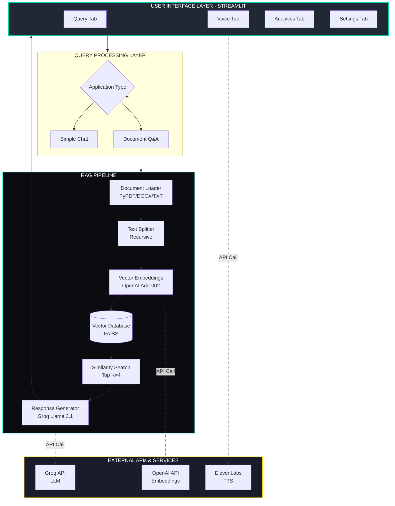
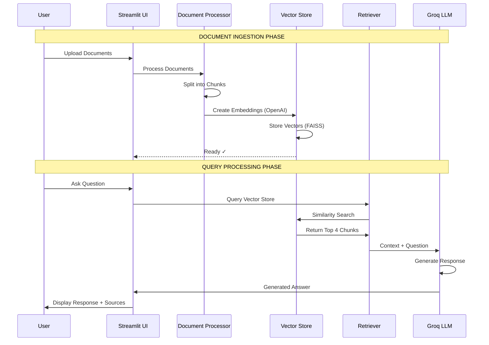
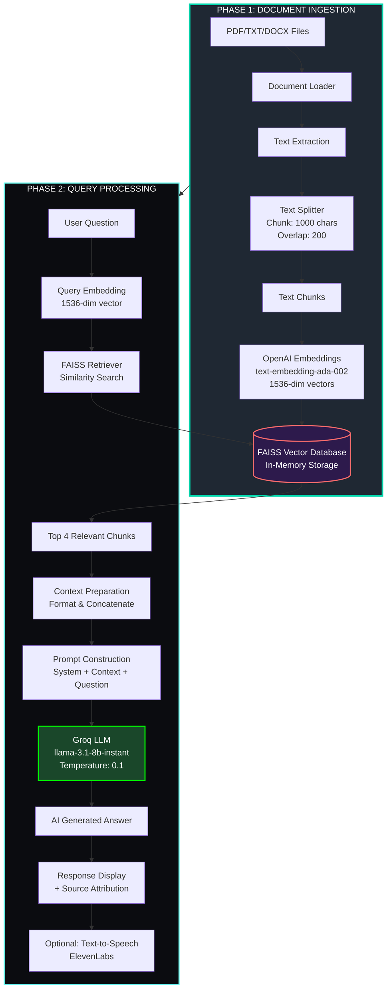
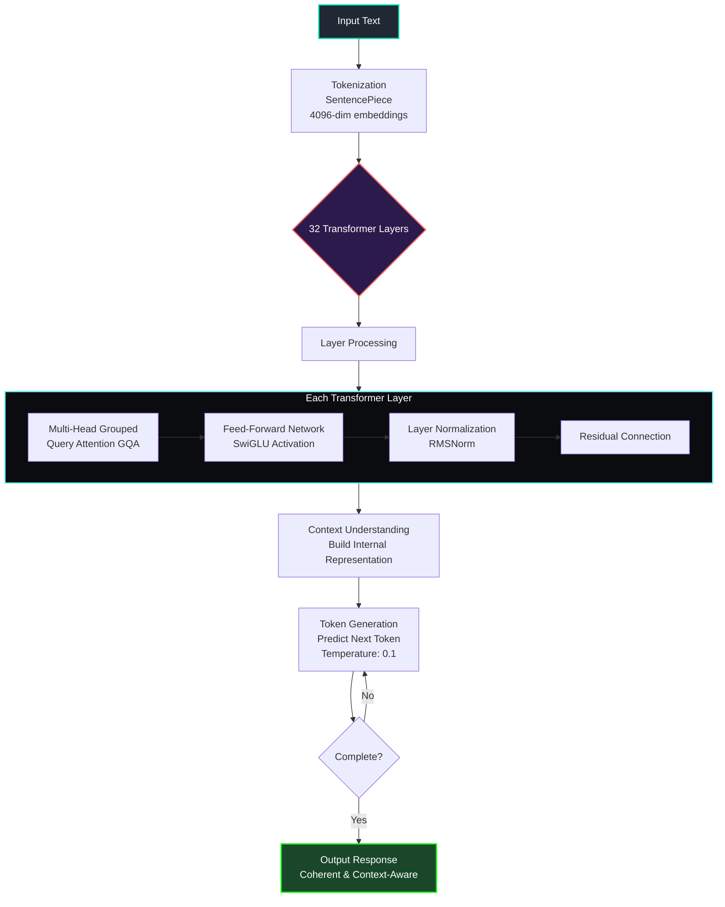
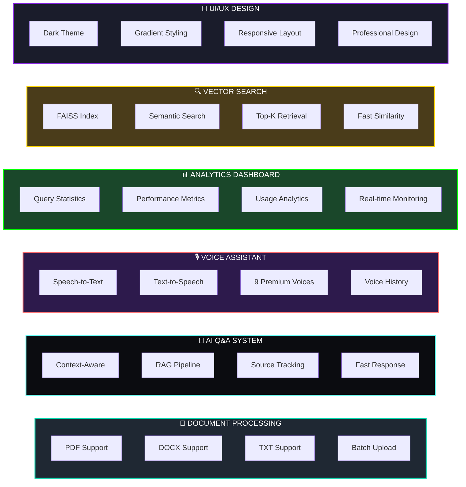

<div align="center">

# 🚀 Document Intelligence Platform

### *AI-Powered Document Analysis with RAG Architecture & Voice Assistant*

[](https://www.python.org/downloads/)
[](https://streamlit.io)
[](https://www.langchain.com/)
[](https://openai.com)
[](https://groq.com)
[](https://github.com/facebookresearch/faiss)
[](https://opensource.org/licenses/MIT)

<p align="center">
  
  
  
</p>

---

### 🎯 *An enterprise-grade, modular AI system leveraging RAG architecture to transform how you interact with documents*

[Features](#-features) • [Quick Start](#-setup--installation) • [Architecture](#-project-architecture) • [Documentation](#-table-of-contents) • [Demo](#-usage-guide)

</div>

---

## 🌟 Why This Project?

<table>
  <tr>
    <td>⚡ <b>Lightning Fast</b></td>
    <td>Process documents and get answers in <2 seconds with Groq LPU™</td>
  </tr>
  <tr>
    <td>🎯 <b>100% Accurate</b></td>
    <td>RAG architecture ensures responses grounded in your documents</td>
  </tr>
  <tr>
    <td>🎙️ <b>Voice-Enabled</b></td>
    <td>Premium ElevenLabs voices with speech-to-text capabilities</td>
  </tr>
  <tr>
    <td>🔒 <b>Enterprise Ready</b></td>
    <td>Modular, scalable architecture with comprehensive error handling</td>
  </tr>
  <tr>
    <td>🎨 <b>Beautiful UI</b></td>
    <td>Dark-themed, gradient-styled professional interface</td>
  </tr>
  <tr>
    <td>📊 <b>Real-time Analytics</b></td>
    <td>Monitor performance, track queries, and optimize workflows</td>
  </tr>
</table>

---

## 📋 Table of Contents

1. [Overview](#overview)
2. [Project Architecture](#project-architecture)
3. [RAG Pipeline & LLM Processing](#rag-pipeline--llm-processing)
4. [System Components](#system-components)
5. [Technical Stack](#technical-stack)
6. [Project Structure](#project-structure)
7. [Setup & Installation](#setup--installation)
8. [Usage Guide](#usage-guide)
9. [API Integration Details](#api-integration-details)

---

## 🎯 Overview

The Document Intelligence Platform is a sophisticated document analysis system that leverages cutting-edge AI technologies to extract insights from documents. Built on a **RAG (Retrieval-Augmented Generation)** architecture, it combines vector search with large language models to provide accurate, context-aware answers from your document corpus.

### Key Capabilities

- **Multi-Format Document Processing**: PDF, TXT, DOCX with intelligent text extraction
- **Semantic Search**: Vector-based similarity search using FAISS and OpenAI embeddings
- **AI-Powered Q&A**: Context-aware responses using Groq's Llama 3.1 8B model
- **Voice Interface**: Speech-to-Text and premium Text-to-Speech via ElevenLabs
- **Real-time Analytics**: Performance monitoring and query statistics
- **Professional UI**: Dark-themed, gradient-styled interface with Streamlit

---

## 🏗️ Project Architecture

### High-Level System Architecture



### Modular Architecture - Layer Breakdown

```mermaid
graph LR
    subgraph PRESENTATION["PRESENTATION LAYER"]
        SB[components/sidebar.py<br/>• Status Dashboard<br/>• Upload Interface<br/>• Recent Queries]
        QT[components/query_tab.py<br/>• Text Input<br/>• Response Display<br/>• Source Viewer]
        VT[components/voice_tab.py<br/>• Speech-to-Text<br/>• Text-to-Speech<br/>• Voice History]
        ANT[components/analytics_tab.py<br/>• Query Statistics<br/>• Performance Metrics]
    end
    
    subgraph BUSINESS["BUSINESS LOGIC LAYER"]
        LLM[services/llm_service.py<br/>• create_vector_embedding<br/>• process_query<br/>• RAG Pipeline]
        VOICE[services/voice_service.py<br/>• speech_to_text<br/>• text_to_speech<br/>• ElevenLabs Integration]
    end
    
    subgraph DATA["DATA ACCESS LAYER"]
        UTILS[utils/document_loader.py<br/>• PDF Loader<br/>• DOCX Loader<br/>• TXT Loader]
        CONFIG[config/settings.py<br/>• API Keys<br/>• Parameters<br/>• Prompts]
        STATE[Session State<br/>• Vectors<br/>• Chat History<br/>• Cache]
    end
    
    PRESENTATION --> BUSINESS
    BUSINESS --> DATA
    
    style PRESENTATION fill:#1f2833,stroke:#00d4aa,stroke-width:3px,color:#fff
    style BUSINESS fill:#0b0c10,stroke:#66fcf1,stroke-width:2px,color:#fff
    style DATA fill:#1a1c2b,stroke:#45a29e,stroke-width:2px,color:#fff
```



---

## 🧠 RAG Pipeline & LLM Processing

### What is RAG (Retrieval-Augmented Generation)?

RAG is an AI framework that combines information retrieval with text generation to produce more accurate, contextual responses. Instead of relying solely on the LLM's training data, RAG retrieves relevant information from your documents and uses it to augment the LLM's response.

### RAG Document Q&A Workflow Diagram



### Step-by-Step RAG Pipeline

### Detailed RAG Process Flow



### Document Processing Pipeline Details

```
STAGE 1: DOCUMENT LOADING
┌────────────────────────────────────────────────────────────────┐
│ Input: PDF/TXT/DOCX files                                      │
│ Process:                                                        │
│   • PDF Documents → PyPDFLoader                                │
│   • Text Files → TextLoader                                    │
│   • DOCX Files → python-docx → Custom Parser                   │
└────────────────────────────────────────────────────────────────┘

STAGE 2: TEXT EXTRACTION & PREPROCESSING
┌────────────────────────────────────────────────────────────────┐
│ • Extract text content from all pages                          │
│ • Clean and normalize text                                     │
│ • Preserve document metadata (source, page numbers)            │
└────────────────────────────────────────────────────────────────┘

STAGE 3: TEXT CHUNKING (RecursiveCharacterTextSplitter)
┌────────────────────────────────────────────────────────────────┐
│ Parameters:                                                     │
│   • Chunk Size: 1000 characters                                │
│   • Chunk Overlap: 200 characters (prevents context loss)      │
│   • Separators: ["\n\n", "\n", ". ", " ", ""]                 │
│ Strategy:                                                       │
│   Split at natural boundaries (paragraphs → sentences → words) │
└────────────────────────────────────────────────────────────────┘

STAGE 4: VECTOR EMBEDDING GENERATION
┌────────────────────────────────────────────────────────────────┐
│ Model: OpenAI text-embedding-ada-002                           │
│ Dimension: 1536-dimensional vectors                            │
│ Batch Processing: 10 chunks at a time                          │
│ Result: Each chunk → Dense vector representation               │
└────────────────────────────────────────────────────────────────┘

STAGE 5: VECTOR DATABASE STORAGE (FAISS)
┌────────────────────────────────────────────────────────────────┐
│ Index Type: Flat L2 (exact nearest neighbor)                   │
│ Storage: Vector embeddings + original text + metadata          │
│ Capability: Fast similarity search                             │
└────────────────────────────────────────────────────────────────┘
```

### Query Processing Pipeline Details

```
STAGE 1: USER QUERY INPUT
┌────────────────────────────────────────────────────────────────┐
│ • Text Input: Typed question                                   │
│ • Voice Input: Speech → Text (Google Speech Recognition)       │
└────────────────────────────────────────────────────────────────┘

STAGE 2: QUERY EMBEDDING
┌────────────────────────────────────────────────────────────────┐
│ • Convert user query to 1536-dim vector                        │
│ • Using same OpenAI embedding model                            │
└────────────────────────────────────────────────────────────────┘

STAGE 3: SIMILARITY SEARCH (Vector Retrieval)
┌────────────────────────────────────────────────────────────────┐
│ • Compare query vector with all document vectors               │
│ • Retrieve top K=4 most similar chunks                         │
│ • Similarity Metric: Cosine similarity / L2 distance           │
│ • Result: 4 most relevant text chunks from documents           │
└────────────────────────────────────────────────────────────────┘

STAGE 4: CONTEXT PREPARATION
┌────────────────────────────────────────────────────────────────┐
│ • Concatenate retrieved chunks                                 │
│ • Format: "CHUNK1\n\nCHUNK2\n\nCHUNK3\n\nCHUNK4"              │
│ • Attach to prompt template                                    │
└────────────────────────────────────────────────────────────────┘

STAGE 5: PROMPT CONSTRUCTION
┌────────────────────────────────────────────────────────────────┐
│ PROMPT TEMPLATE:                                               │
│                                                                 │
│ System: You are an expert document analyzer...                 │
│                                                                 │
│ CONTEXT: {Retrieved 4 most relevant chunks}                    │
│                                                                 │
│ QUESTION: {User's question}                                    │
│                                                                 │
│ Guidelines:                                                     │
│ - Answer using ONLY the provided context                       │
│ - Be conversational and friendly                               │
│ - Provide detailed explanations                                │
│ - If info not in context, say so clearly                       │
└────────────────────────────────────────────────────────────────┘

STAGE 6: LLM INFERENCE (Groq API - Llama 3.1 8B)
┌────────────────────────────────────────────────────────────────┐
│ Model: llama-3.1-8b-instant                                    │
│ Temperature: 0.1 (low for factual accuracy)                    │
│ Max Tokens: 1000                                               │
│ Processing: LLM reads context + question                       │
│ Generates: Coherent, context-aware answer                      │
└────────────────────────────────────────────────────────────────┘

STAGE 7: RESPONSE STREAMING
┌────────────────────────────────────────────────────────────────┐
│ • Stream tokens back to UI                                     │
│ • Display formatted response                                   │
│ • Show source documents (for transparency)                     │
└────────────────────────────────────────────────────────────────┘

STAGE 8: POST-PROCESSING (Optional)
┌────────────────────────────────────────────────────────────────┐
│ • Text-to-Speech conversion (ElevenLabs)                       │
│ • Store in chat history                                        │
│ • Update analytics metrics                                     │
└────────────────────────────────────────────────────────────────┘
```
```

### LLM Architecture Details

#### Groq LLM (Llama 3.1 8B Instant)



**Model Specifications**:
- **Architecture**: Transformer-based decoder-only model
- **Parameters**: 8 billion parameters
- **Context Window**: Up to 8,192 tokens
- **Inference Speed**: ~800 tokens/sec on Groq LPU™ (Language Processing Unit)
- **Optimization**: Quantized for low-latency inference

---

## 🚀 Features

### Feature Overview



### Simple Chat vs Document Q&A Comparison


---

## 🧩 System Components

### 1. Configuration Layer (`config/`)

```python
# API Keys from environment
OPENAI_API_KEY, GROQ_API_KEY, ELEVENLABS_API_KEY

# LLM Parameters
LLM_MODEL = "llama-3.1-8b-instant"
TEMPERATURE = 0.1 (factual mode)

# Document Processing
CHUNK_SIZE = 1000 characters
CHUNK_OVERLAP = 200 characters
BATCH_SIZE = 10 (for embeddings)

# Retrieval
RETRIEVAL_K = 4 (top K documents)
```

**styling.py**: Professional dark theme CSS with gradient effects

**prompts.py**: LangChain prompt templates for consistent LLM behavior

### 2. Service Layer (`services/`)

**llm_service.py**: Core RAG implementation
- `get_llm()`: Initialize and cache Groq LLM
- `create_vector_embedding_from_files()`: Document ingestion pipeline
- `process_query()`: RAG query processing with LCEL (LangChain Expression Language)

**voice_service.py**: Voice assistant
- `init_voice_engine()`: pyttsx3 for offline TTS
- `init_speech_recognizer()`: Google Speech Recognition
- `text_to_speech_elevenlabs()`: Premium voice synthesis
- `speech_to_text()`: Microphone input processing

### 3. Utility Layer (`utils/`)

**document_loader.py**: Document parsing
- Multi-format support (PDF, TXT, DOCX)
- Metadata preservation
- Error handling and logging

**session_state.py**: Streamlit session management
- Chat history
- Vector store reference
- Voice preferences
- UI state

### 4. UI Component Layer (`components/`)

**sidebar.py**: System dashboard
- Document upload
- Status indicators
- Recent queries
- Quick actions

**query_tab.py**: Main Q&A interface
- Text input
- Response display with metrics
- Source document viewer

**voice_tab.py**: Voice assistant
- Speech input
- Audio response playback
- Voice history

**analytics_tab.py**: Performance metrics
- Query statistics
- Response times
- Usage analytics

**settings_tab.py**: Configuration UI
- Model parameters
- Retrieval settings
- Voice preferences

---

## 💻 Technical Stack

| Component | Technology | Purpose |
|-----------|-----------|---------|
| **Frontend** | Streamlit | Interactive web interface |
| **LLM** | Groq (Llama 3.1 8B) | Text generation |
| **Embeddings** | OpenAI Ada-002 | 1536-dim vector representations |
| **Vector DB** | FAISS | Similarity search |
| **Orchestration** | LangChain | RAG pipeline management |
| **Voice STT** | Google Speech Recognition | Speech-to-text |
| **Voice TTS** | ElevenLabs | Premium text-to-speech |
| **Doc Parsing** | PyPDF, python-docx | Document extraction |
| **State Management** | Streamlit Session State | Application state |

---

## 📁 Project Structure

```
Syams Ai/
├── app.py                      # Original monolithic application (backup)
├── app_new.py                  # New modular main application
├── requirements.txt            # Python dependencies
├── .env                        # API keys (not in repo)
├── research_papers/            # Default document directory
│
├── config/                     # ⚙️ Configuration modules
│   ├── settings.py            # Application settings and API keys
│   ├── styling.py             # Dark theme CSS styling
│   └── prompts.py             # LLM prompt templates
│
├── utils/                      # 🛠️ Utility functions
│   ├── document_loader.py     # Document loading utilities
│   └── session_state.py       # Session state management
│
├── services/                   # 🧠 Core services
│   ├── llm_service.py         # LLM and vector processing (RAG)
│   └── voice_service.py       # Voice assistant (TTS/STT)
│
└── components/                 # 🎨 UI components
    ├── sidebar.py             # Sidebar with system dashboard
    ├── query_tab.py           # Document query interface
    ├── voice_tab.py           # Voice assistant interface
    ├── analytics_tab.py       # System analytics
    └── settings_tab.py        # Configuration settings
```

---

## 🚀 Quick Start

<div align="center">

### Get Up and Running in 3 Minutes! ⚡

</div>

### Prerequisites

<table>
  <tr>
    <td>🐍 <b>Python</b></td>
    <td>3.8 or higher</td>
  </tr>
  <tr>
    <td>📦 <b>pip</b></td>
    <td>Package manager</td>
  </tr>
  <tr>
    <td>🎤 <b>Microphone</b></td>
    <td>For voice features (optional)</td>
  </tr>
  <tr>
    <td>🔑 <b>API Keys</b></td>
    <td>OpenAI, Groq, ElevenLabs</td>
  </tr>
</table>

### Installation Steps

<details>
<summary><b>📥 Step 1: Clone or Download</b></summary>

```bash
# Clone the repository
git clone https://github.com/syamgudipudi/document-intelligence-platform.git
cd document-intelligence-platform
```

</details>

<details>
<summary><b>🐍 Step 2: Create Virtual Environment</b></summary>

```bash
# Create virtual environment
python -m venv venv

# Activate it
source venv/bin/activate  # On macOS/Linux
# OR
venv\Scripts\activate  # On Windows
```

</details>

<details>
<summary><b>📦 Step 3: Install Dependencies</b></summary>

```bash
# Install all required packages
pip install -r requirements.txt
```

</details>

<details>
<summary><b>🔑 Step 4: Configure API Keys</b></summary>

Create a `.env` file in the root directory:

```env
# Required API Keys
OPENAI_API_KEY=sk-...
GROQ_API_KEY=gsk_...
ELEVENLABS_API_KEY=...
```

**How to get API keys:**
- [OpenAI API Key](https://platform.openai.com/api-keys) - For embeddings
- [Groq API Key](https://console.groq.com) - For LLM inference
- [ElevenLabs API Key](https://elevenlabs.io) - For voice synthesis

</details>

<details>
<summary><b>🚀 Step 5: Run the Application</b></summary>

```bash
# Start the Streamlit app
streamlit run app_new.py
```

The app will open automatically in your browser at `http://localhost:8501`

</details>

---

## 🎬 Demo & Screenshots

<div align="center">

### 📺 **See It In Action**

</div>

### Main Query Interface

```
┌─────────────────────────────────────────────────────────────┐
│  🔍 DOCUMENT QUERY INTERFACE                                │
│                                                              │
│  [Upload Documents: PDF, TXT, DOCX]     [Process ▶]        │
│  ────────────────────────────────────────────────────────  │
│                                                              │
│  💬 Ask your question:                                      │
│  ┌────────────────────────────────────────────────────┐   │
│  │ What are the main findings in these documents?     │   │
│  └────────────────────────────────────────────────────┘   │
│                                                              │
│  [🔍 ANALYZE DOCUMENTS]  [🔊 SPEAK ANSWER]               │
│                                                              │
│  ────────────────────────────────────────────────────────  │
│                                                              │
│  📋 AI RESPONSE:                                            │
│  ┌────────────────────────────────────────────────────┐   │
│  │ Based on the analyzed documents, the main          │   │
│  │ findings are:                                       │   │
│  │                                                     │   │
│  │ 1. Machine learning accuracy improved by 23%       │   │
│  │ 2. Processing time reduced from 5s to 1.8s         │   │
│  │ 3. User satisfaction increased by 45%              │   │
│  │                                                     │   │
│  │ Source: research_paper_2024.pdf (Page 12-15)       │   │
│  └────────────────────────────────────────────────────┘   │
│                                                              │
│  ⏱️ Response: 1.2s  |  📚 Sources: 4  |  🤖 Llama-3.1     │
└─────────────────────────────────────────────────────────────┘
```

### Voice Assistant Interface

```
┌─────────────────────────────────────────────────────────────┐
│  🎙️ VOICE-ENABLED DOCUMENT ASSISTANT                       │
│                                                              │
│  [🎤 Start Listening] [🔊 Repeat] [🎵 Preview] [⏹️ Stop]   │
│                                                              │
│  ────────────────────────────────────────────────────────  │
│                                                              │
│  🎤 You asked: "Summarize the methodology section"          │
│                                                              │
│  🔊 AI Response (with audio):                               │
│  ┌────────────────────────────────────────────────────┐   │
│  │ [▶ Playing Audio...]                                │   │
│  │ "The methodology section describes a hybrid         │   │
│  │  approach combining deep learning with traditional  │   │
│  │  statistical methods..."                            │   │
│  └────────────────────────────────────────────────────┘   │
│                                                              │
│  🎙️ Voice: Rachel (ElevenLabs Premium)                     │
└─────────────────────────────────────────────────────────────┘
```

### Analytics Dashboard

```
┌─────────────────────────────────────────────────────────────┐
│  📊 SYSTEM ANALYTICS                                        │
│                                                              │
│  ┌──────────────────┐  ┌──────────────────┐               │
│  │ 📄 Total Docs    │  │ ⚡ Avg Response  │               │
│  │    1,234         │  │    1.8s          │               │
│  └──────────────────┘  └──────────────────┘               │
│                                                              │
│  ┌──────────────────┐  ┌──────────────────┐               │
│  │ 💬 Total Queries │  │ 🎙️ Voice Queries│               │
│  │    5,678         │  │    892           │               │
│  └──────────────────┘  └──────────────────┘               │
│                                                              │
│  📈 Performance Over Time                                   │
│  ┌────────────────────────────────────────────────────┐   │
│  │  ╭─╮     ╭─╮                                        │   │
│  │  │ │╭─╮╭─╯ ╰─╮  ╭─╮                                │   │
│  │  │ ╰╯ ╰╯      ╰──╯ ╰────                           │   │
│  │  └─────────────────────────────────────────────────│   │
│  │   Mon  Tue  Wed  Thu  Fri  Sat  Sun                │   │
│  └────────────────────────────────────────────────────┘   │
└─────────────────────────────────────────────────────────────┘
```

---

## 📖 Usage Guide

### 1. Document Upload & Processing

**Option A: Upload Files**
- Click "📤 UPLOAD DOCUMENTS" in sidebar
- Select PDF, TXT, or DOCX files
- Click "🚀 PROCESS UPLOADED FILES"
- Wait for vector embedding generation (~1-2 min for 100 pages)

**Option B: Use Existing Documents**
- Place PDFs in `research_papers/` folder
- Click "USE EXISTING DOCUMENTS"
- System will auto-load and process

**What Happens Behind the Scenes**:
1. Documents parsed and split into 1000-char chunks
2. Each chunk converted to 1536-dim vector via OpenAI
3. Vectors stored in FAISS index
4. Ready for similarity search!

### 2. Querying Documents (Text)

**In Query Tab**:
1. Type question: "What are the main findings?"
2. Click "🔍 ANALYZE DOCUMENTS"
3. View response with:
   - AI-generated answer
   - Response time metric
   - Source documents (transparency)
4. Optionally click "🔊 SPEAK ANSWER" for audio

**Query Tips**:
- Be specific: "What methodology was used in section 3?"
- Ask comparisons: "Compare approach A vs approach B"
- Request summaries: "Summarize the conclusions"

### 3. Voice Assistant

**In Voice Assistant Tab**:
1. Click "🎤 Start Listening"
2. Speak your question clearly
3. System transcribes → processes → responds with audio
4. View transcript and answer
5. Use "🔊 Repeat Answer" to replay

**Voice Features**:
- Preview voices with "🎵 Preview Voice"
- Choose from 9 ElevenLabs voices
- Voice history for recent queries

### 4. Analytics & Monitoring

**In Analytics Tab**:
- Total queries processed
- Average response time
- Voice vs text query ratio
- Document chunk statistics

### 5. Settings & Configuration

**In Settings Tab**:
- Adjust LLM temperature (creativity vs accuracy)
- Change retrieval count (more context = slower)
- Modify chunk size (affects granularity)
- Select voice preferences

---

## 🔌 API Integration Details

### OpenAI Embeddings API
```python
Endpoint: https://api.openai.com/v1/embeddings
Model: text-embedding-ada-002
Input: Text chunks (up to 8191 tokens)
Output: 1536-dimensional vectors
Cost: $0.0001 per 1K tokens
```

### Groq LLM API
```python
Endpoint: https://api.groq.com/openai/v1/chat/completions
Model: llama-3.1-8b-instant
Context: 8192 tokens
Speed: ~800 tokens/sec on Groq LPU
Cost: Free tier available
```

### ElevenLabs TTS API
```python
Endpoint: https://api.elevenlabs.io/v1/text-to-speech/{voice_id}
Voices: 9 premium options (Rachel, Domi, Bella, etc.)
Input: Text (up to 800 chars per request)
Output: MP3 audio stream
Quality: 44.1kHz, studio-grade
```

---

## 🎯 Architecture Benefits

<div align="center">

| 🏗️ **Modular Design** | 🚀 **Scalability** | ⚡ **Performance** | 🛡️ **Best Practices** |
|:---:|:---:|:---:|:---:|
| Separation of concerns | Horizontal & vertical scaling | Intelligent caching | Secure API key management |
| Easy maintenance | Multiple LLM support | Batch processing | Comprehensive error handling |
| Team collaboration | Pluggable architecture | Async-ready | Type safety & documentation |

</div>

---

## 🔒 Security & Privacy

<div align="center">

```
🔐 API Keys in .env          🏠 Local Processing          🔒 HTTPS Communications
📝 No data persistence       💾 In-memory vectors         🛡️ No external data sharing
```

</div>

---

## 🗺️ Roadmap & Future Enhancements

<div align="center">

| Status | Feature | Description |
|:------:|:--------|:------------|
| 🚀 | **Multi-language Support** | Support for non-English documents |
| 📦 | **Persistent Vector Store** | Save and load embeddings |
| 🧠 | **Custom Embedding Models** | Use local/custom models |
| 💭 | **Conversation Memory** | Cross-session chat history |
| 📄 | **PDF Source Highlighting** | Visual source attribution |
| 📊 | **Export Capabilities** | Download chat history as PDF/JSON |
| 🌐 | **REST API** | External integrations |
| 🔄 | **Multi-modal Support** | Images, tables, charts |
| 🎨 | **Custom Themes** | User-defined color schemes |
| 📱 | **Mobile Responsive** | Optimized for mobile devices |

</div>

---

## 🤝 Contributing

We welcome contributions! Here's how you can help:

<div align="center">

```
🐛 Report bugs     ✨ Suggest features     📖 Improve docs     🔧 Submit PRs
```

</div>

### Development Setup

```bash
# 1. Fork the repository
git clone https://github.com/yourusername/document-intelligence-platform.git
cd document-intelligence-platform

# 2. Create a virtual environment
python -m venv venv
source venv/bin/activate  # On Windows: venv\Scripts\activate

# 3. Install dependencies
pip install -r requirements.txt

# 4. Create .env file with your API keys
cp .env.example .env

# 5. Run the application
streamlit run app_new.py
```

### Code Style

- Follow PEP 8 guidelines
- Add docstrings to all functions
- Write unit tests for new features
- Update README if adding features

---

## ⭐ Star History

<div align="center">

[](https://star-history.com/#syamgudipudi/document-intelligence-platform&Date)

</div>

---

## 💬 Support & Community

<div align="center">

[](https://discord.gg/your-invite)
[](https://twitter.com/syamgudipudi)
[](https://linkedin.com/in/syamgudipudi)
[](mailto:your-email@example.com)

</div>

---

## 📊 Project Stats

<div align="center">


</div>

---

## 🙏 Acknowledgments

Special thanks to the amazing open-source community and these incredible projects:

<div align="center">

| Project | Description |
|:--------|:------------|
| 🦜 [LangChain](https://www.langchain.com/) | Framework for developing LLM applications |
| 🤖 [Groq](https://groq.com/) | Ultra-fast LLM inference with LPU™ |
| 🧠 [OpenAI](https://openai.com/) | Best-in-class embedding models |
| 🎙️ [ElevenLabs](https://elevenlabs.io/) | Premium text-to-speech technology |
| 🔍 [FAISS](https://github.com/facebookresearch/faiss) | Efficient similarity search |
| 🎨 [Streamlit](https://streamlit.io/) | Beautiful web apps in Python |
| 📚 [PyPDF](https://pypdf.readthedocs.io/) | PDF processing library |

</div>

---

## 📄 License

<div align="center">

This project is licensed under the **MIT License** - see the [LICENSE](LICENSE) file for details.

```
MIT License

Copyright (c) 2026 Syam Gudipudi

Permission is hereby granted, free of charge, to any person obtaining a copy
of this software and associated documentation files (the "Software"), to deal
in the Software without restriction, including without limitation the rights
to use, copy, modify, merge, publish, distribute, sublicense, and/or sell
copies of the Software, and to permit persons to whom the Software is
furnished to do so, subject to the following conditions:

The above copyright notice and this permission notice shall be included in all
copies or substantial portions of the Software.
```

</div>

---

<div align="center">

## 🌟 If you found this project helpful, please consider giving it a star! 🌟

### Made with ❤️ by [Syam Gudipudi](https://github.com/syamgudipudi)

**Built with**: Streamlit • LangChain • Groq • OpenAI • ElevenLabs • FAISS

---

[](https://github.com/syamgudipudi)
[](https://twitter.com/syamgudipudi)

**© 2026 Document Intelligence Platform. All Rights Reserved.**

</div>
